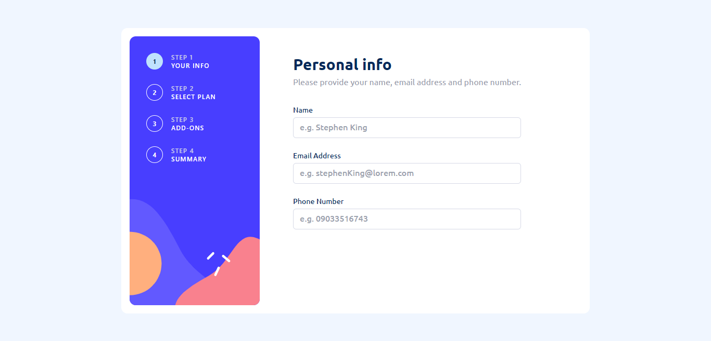

# Frontend Mentor - Multi-step form solution

This is a solution to the [Multi-step form challenge on Frontend Mentor](https://www.frontendmentor.io/challenges/multistep-form-YVAnSdqQBJ). Frontend Mentor challenges help you improve your coding skills by building realistic projects. 

### The challenge

Users should be able to:

- Complete each step of the sequence
- Go back to a previous step to update their selections
- See a summary of their selections on the final step and confirm their order
- View the optimal layout for the interface depending on their device's screen size
- See hover and focus states for all interactive elements on the page
- Receive form validation messages if:
  - A field has been missed
  - The email address is not formatted correctly
  - A step is submitted, but no selection has been made

  ### Screenshot

### Links

- Solution URL: [multi form github](https://github.com/nick335/MultiStepForm-Typescript)
- Live Site URL: [multi form live](https://multi-form45.netlify.app/)

### Built with

- Semantic HTML5 markup
- Tailwind CSS
- Typescript
- React Router
- Mobile-first workflow
- [React](https://reactjs.org/) - JS library
- Redux Toolkit

### What I learned
- learnt how to create a custom 404 page using react router for routes that are not available

## Author

- Website - [Nicholas](https://nicholaserigo.netlify.app/)
- Frontend Mentor - [@nick335](https://www.frontendmentor.io/profile/nick335)

- Twitter - [@nicholas](https://twitter.com/ChigozieErigo)
